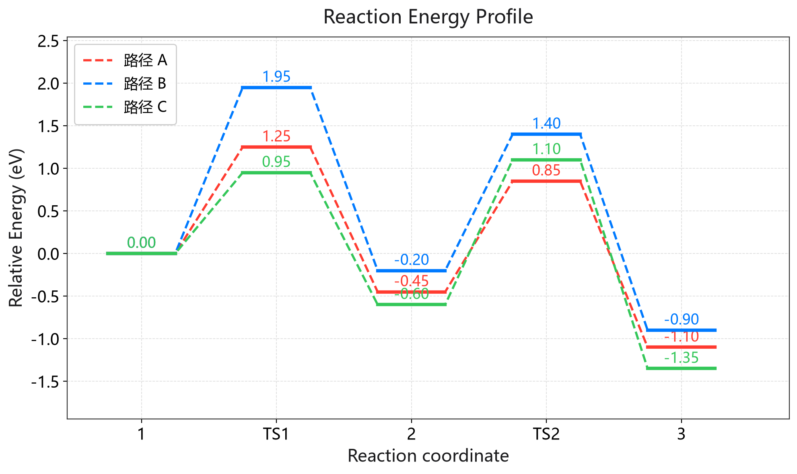
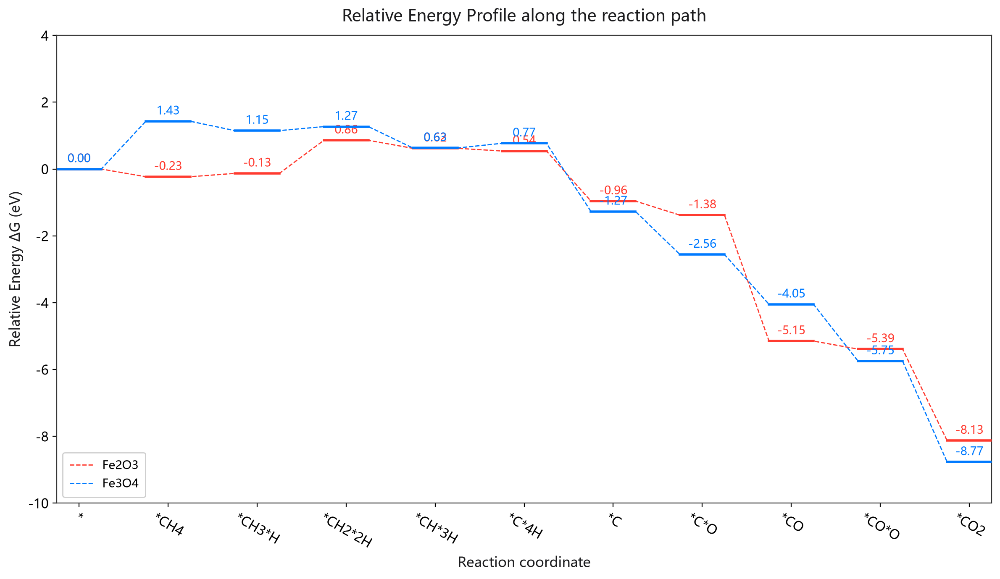
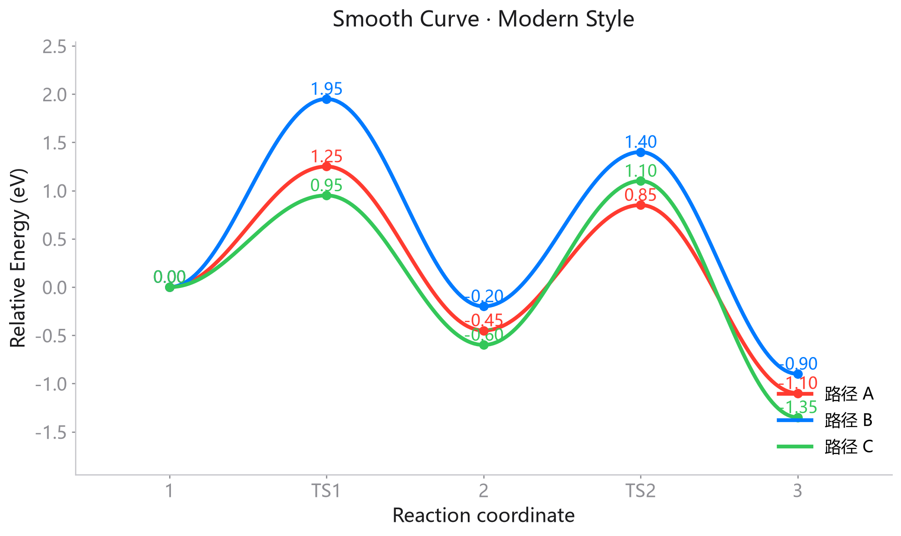

<div align="center">


# Energy Profile Studio
### 反应势能面剖面图工作台 · 能垒图一键绘制

**纯 PySide6 (Qt 6) + Matplotlib · iOS 风格界面 · 免安装单文件 exe**

绘一张漂亮、可直接发表的能垒图，只需要填几个数字。

<br/>

[](https://github.com/moyulyy/plot_FreeEnergy/releases/latest)
[](https://www.python.org/)
[](https://doc.qt.io/qtforpython/)
[](https://matplotlib.org/)
[](#-下载--安装)
[](LICENSE)

<br/>



<sub>▲ 软件渲染效果（示例数据 · 虚实折线 · 经典风格）</sub>

</div>

---

## 📥 下载 / 安装

### 方式一：免安装单文件 exe（推荐 ⭐）

直接前往 **[Releases 页面](https://github.com/moyulyy/plot_FreeEnergy/releases/latest)** 下载
`EnergyProfileStudio.exe`，**双击即用，无需安装 Python 或任何依赖**。

> - 单文件约 **75 MB**，首次启动需数秒（会先解压到临时目录）。
> - 图标为蓝色渐变 + 白色能垒曲线。
> - 若启动异常，会在 exe 同目录生成 `studio_error.log`，可据此排查。

### 方式二：从源码运行

```bash
git clone https://github.com/moyulyy/plot_FreeEnergy.git
cd plot_FreeEnergy
pip install -r requirements.txt
python Plot_EnergyProfile-Studio.py
```

也可使用 conda（见 [`environment.yml`](environment.yml)）：

```bash
conda env create -f environment.yml
conda activate chem_env
python Plot_EnergyProfile-Studio.py
```

---

## ✨ 功能特性

| | 特性 | 说明 |
|---|------|------|
| 🎨 | **iOS 风格界面** | 圆角卡片、开关 / 分段控件、平滑滚动条、蓝色强调色 |
| 📈 | **6 种能垒图样式** | 横线+曲线、平滑曲线、虚实折线、MEP 平滑曲线、MEP 横线+曲线、MEP 虚实折线 |
| 📋 | **零门槛数据输入** | 表格直接填写，或从 **Excel / CSV 导入** |
| 📑 | **Excel 一键粘贴** | 复制一列 / 一行 / 一块数据，`Ctrl+V` 自动识别并补齐台阶数 |
| 🔢 | **数值对齐可调** | 每个台阶的能量数值支持 **居左 / 居中 / 居右** |
| 📐 | **坐标轴精细控制** | 横/纵轴范围、刻度间隔，或一键自动 Y 轴 |
| 🖱️ | **图像交互** | 滚轮缩放（光标锚定）、拖动平移、双击复位 |
| 💾 | **多种导出** | PNG / JPEG / PDF / SVG（300 dpi）、CSV、Excel、JSON 方案 |
| 🧩 | **零额外依赖读写** | 内置标准库实现 `.xlsx` 读写，无需 openpyxl / pandas |

<details>
<summary><b>🖼 查看更多效果图（点击展开）</b></summary>

<br/>

**CO₂ 还原反应路径（Fe₂O₃ vs Fe₃O₄，含过渡态）**



**平滑曲线 · 简约风格**



</details>

---

## 🖥 界面布局

```
┌──────────────────────────────┬──────────────────────────────────────────────┐
│  能垒图工作台                 │  图像预览                  [重置视图] [保存图片] │
│                              │  ┌────────────────────────────────────────┐  │
│  ┌ 标题与坐标轴 ───────────┐  │  │                                        │  │
│  ┌ 反应路径数据 ───────────┐  │  │            Matplotlib 画布              │  │
│  │  台阶数 [- 5 +]          │  │  │        滚轮缩放 / 拖动平移 / 双击复位   │  │
│  │  路径数 [- 3 +]          │  │  │                                        │  │
│  │  ┌────┬────┬────┬────┐  │  │  └────────────────────────────────────────┘  │
│  │  │节点│路径A│路径B│路径C│ │  │  ┌ 坐标轴设置 ────────────────────────────┐  │
│  │  │    │    │    │    │  │  │  │ 横轴范围 [__]~[__]  横轴刻度间隔 [__]   │  │
│  │  └────┴────┴────┴────┘  │  │  │ 纵轴范围 [__]~[__]  纵轴刻度间隔 [__]   │  │
│  │  [导入 Excel/CSV][粘贴]  │  │  │                          自动 Y (●──)   │  │
│  ┌ 绘图样式 ───────────────┐  │  └────────────────────────────────────────┘  │
│  ┌ 尺寸与字号 ─────────────┐  │                                              │
│  ┌ 导出与方案 ─────────────┐  │                                              │
│  [生成 / 更新图像] [重置参数] │  │                                              │
└──────────────────────────────┴──────────────────────────────────────────────┘
```

左侧自上而下为 5 张参数卡片；右侧为预览区 + 底部坐标轴设置条。

---

## 📊 数据输入

数据区的表格约定：**横向是路径，纵向是台阶**。

```
              ┌─ 路径 A ─┬─ 路径 B ─┬─ 路径 C ─┐
节点 / 路径    │  VAC-OH  │  U=0-OH  │  VAC-H   │
颜色          │  ■ 红    │  ■ 蓝    │  ■ 绿    │
线型          │  实线    │  虚线    │  实线    │
1             │   0.00   │   0.00   │   0.00   │
TS1           │   1.25   │   1.95   │   0.95   │   ← 名称含 TS 视为过渡态
2             │  -0.45   │  -0.20   │  -0.60   │
TS2           │   0.85   │   1.40   │   1.10   │
3             │  -1.10   │  -0.90   │  -1.35   │
```

### 1. 手动填写

直接在表格单元格中输入；用「台阶数 / 路径数」步进器增删行列。

### 2. 从 Excel 粘贴（推荐）

1. 在 Excel 中选中并复制数据（一列、一行或一整块）；
2. 回到本工具，**点击目标单元格**（例如某条路径的第一个数值格）；
3. 按 `Ctrl+V`。

| 复制内容 | 粘贴效果 |
|----------|----------|
| 一列数值 | 填入该路径列；**台阶不足会自动补齐**（新台阶自动命名 `节点N`） |
| 一行（Tab 分隔） | 依次填入多条路径；路径不足会自动新增 |
| 一整块（首列为台阶名） | 从台阶名单元格粘贴，可同时写入台阶名 + 各路径数值 |

> 解析容错：换行 / 制表符混用、结尾空行、空列、Excel 文本引号、首尾空格均会自动清理。
> 也可点击工具栏的 **「粘贴」** 按钮，粘到上次选中的单元格。

### 3. 导入 Excel / CSV

点击 **「导入 Excel / CSV」**，支持 `.xlsx`、`.xlsm`、`.csv`。
文件布局与上表一致，兼容两种写法：

- **仅数据**：第 1 行为路径名称，第 1 列为台阶名称，其余为能量值。
- **含格式模板**：第 2 行 `color` / `颜色`，第 3 行 `linestyle` / `线型`，第 4 行起为数据。

颜色支持十六进制（`#FF0000`）、颜色名（`red`）或单字母（`r`、`b`）。

---

## ⚙️ 参数说明

### 标题与坐标轴
图表标题、横轴标题、纵轴标题。

### 绘图样式

| 选项 | 说明 |
|------|------|
| 图像类型 | 6 种能垒图样式（默认**虚实折线**） |
| 显示能量数值 | 是否在每个台阶上标注数值 |
| 数值对齐 | 台阶数值 **居左 / 居中 / 居右** |
| 自动避让文字 | 数值重叠时自动错开 |
| 显示图例 / 图例位置 | 图例开关与位置 |
| 显示网格 | 是否绘制网格 |
| 图表风格 | **经典**（默认，四边框 + 虚线网格）/ 简约（隐藏上右边框） |

### 尺寸与字号
数值字号、坐标轴字号、曲线宽度、X 标签旋转角度与对齐方式、导出尺寸（英寸）。

### 坐标轴设置（右下方）

- **横轴范围**：留空自动，或指定 min ~ max
- **横轴刻度间隔**：留空自动，或指定数值间隔
- **纵轴范围**：配合「自动 Y」开关使用
- **纵轴刻度间隔**：留空自动，或指定数值间隔

---

## 🖱 图像交互 & 快捷键

| 操作 | 效果 |
|------|------|
| 滚轮 | 以光标为中心缩放 |
| 按住左键拖动 | 平移 |
| 双击 | 复位视图 |
| `Ctrl+R` | 重置视图 |
| `Ctrl+S` | 保存图片 |
| `Ctrl+O` | 导入数据 |
| `Ctrl+V` | 粘贴数据 |

> 参数改动后会**自动防抖刷新**（约 0.26 s），无需手动点按钮。

---

## 📤 导出与方案

| 按钮 | 说明 |
|------|------|
| 保存图片 | PNG / JPEG / PDF / SVG，300 dpi，尺寸取「导出尺寸」 |
| 导出 CSV | 与导入解析格式一致，可再次导入 |
| 导出 Excel | `.xlsx`，前三行加粗，列宽自适应，可再次导入 |
| 保存方案 | 把当前全部参数与数据存为 `.json` |
| 载入方案 | 读取 `.json` 方案并恢复 |

> 导出的 CSV / Excel 与导入解析完全兼容，可反复「导出 → 修改 → 导入」。

---

## 📦 打包为 exe

已提供打包配置文件 `EnergyProfileStudio.spec`，它会额外收集 conda 环境
`Library\bin` 下的 DLL（否则会出现 `DLL load failed while importing pyexpat`）。

```bash
# 1. 安装打包工具
pip install pyinstaller

# 2. 一键打包（自动生成图标 + 清理 + 打包）
build_exe.bat

# 或者手动分步执行
python make_icon.py
python -m PyInstaller --noconfirm --clean EnergyProfileStudio.spec
```

输出：`dist\EnergyProfileStudio.exe`（单文件、免安装、约 75 MB）

> 图标由 `make_icon.py` 使用 Pillow 生成（多尺寸 `app.ico`），
> 程序运行时也会用同一套设计绘制窗口图标，两者一致。

---

## 🗂 文件结构

```
.
├── Plot_EnergyProfile-Studio.py     ★ 主程序（PySide6 GUI）
├── plot_core.py                       绘图与数据核心（与界面无关，可单独调用）
├── run.bat                            Windows 启动器（chem_env + pythonw）
├── build_exe.bat                      一键打包 exe
├── EnergyProfileStudio.spec           PyInstaller 打包配置
├── make_icon.py                       生成 app.ico / app.png
├── app.ico / app.png                  应用图标
├── docs/                              文档配图（README 效果图）
├── requirements.txt                   pip 依赖
├── environment.yml                    conda 环境（可选）
├── README.md                          本文档
└── EnergyProfile.xlsx                 示例数据
```

### 🧩 脱离界面单独调用 `plot_core`

```python
import plot_core as pc
from matplotlib.figure import Figure

fig = Figure(figsize=(10, 6), facecolor="white")
cfg = {
    "title": "Energy Profile", "xlabel": "Reaction coordinate",
    "ylabel": "ΔG (eV)", "labels": ["1", "TS1", "2", "TS2", "3"],
    "paths": [{"name": "Path A", "color": "#FF3B30", "style": "-",
               "values": [0.0, 1.25, -0.45, 0.85, -1.10]}],
    "plottype": "Line_Dot", "showtext": True, "textalign": "center",
    "adjust": False, "legend": True, "legendpos": "upper left",
    "grid": True, "modern": False, "autoy": True, "ymin": -2, "ymax": 2,
    "xmin": None, "xmax": None, "xtick": None, "ytick": None,
    "datafont": 13, "axisfont": 14, "linewidth": 3, "rotation": 0,
    "rotcenter": "center", "figw": 10, "figh": 6,
}
ax = pc.render_profile(fig, cfg)
fig.savefig("profile.png", dpi=300, bbox_inches="tight")
```

---

## ❓ 常见问题

<details>
<summary><b>双击 <code>run.bat</code> 没有反应？</b></summary>

先确认 `D:\miniconda3\envs\chem_env\pythonw.exe` 存在；若程序启动时报错，会在同目录生成 `studio_error.log`，打开查看原因。也可临时把 `run.bat` 里的 `pythonw.exe` 改成 `python.exe` 以便看到控制台输出。
</details>

<details>
<summary><b>导入 <code>.xls</code> 失败？</b></summary>

仅支持 `.xlsx` / `.xlsm` / `.csv`，请先在 Excel 中「另存为」`.xlsx`。
</details>

<details>
<summary><b>中文字体显示为方框？</b></summary>

Windows 建议安装/启用「微软雅黑」。程序已内置 `Microsoft YaHei / SimHei / PingFang SC` 等字体回退列表。
</details>

<details>
<summary><b>能量数值文字重叠？</b></summary>

打开「自动避让文字」。若未安装 `adjustText`，程序会使用内置的轻量避让算法（仅纵向错开）。
</details>

<details>
<summary><b>粘贴后台阶数没变？</b></summary>

只有粘贴内容超出现有台阶数时才会自动补齐；且需先**点击**目标单元格再粘贴。路径列不会自动创建，除非粘贴的是多列数据块。
</details>

<details>
<summary><b>如何恢复默认参数？</b></summary>

点击左下角「重置参数」（不会清空数据表）。
</details>

---

<div align="center">

**如果这个工具帮到了你，欢迎点一个 ⭐ Star 支持一下！**

[⬆ 回到顶部](#energy-profile-studio)

</div>
